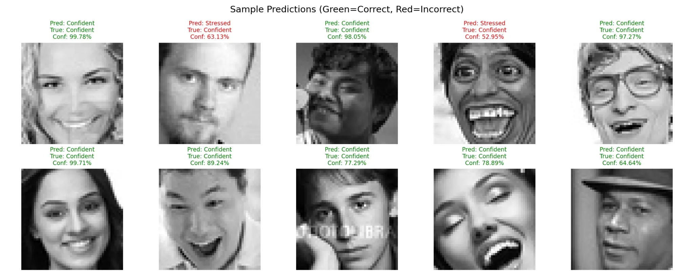
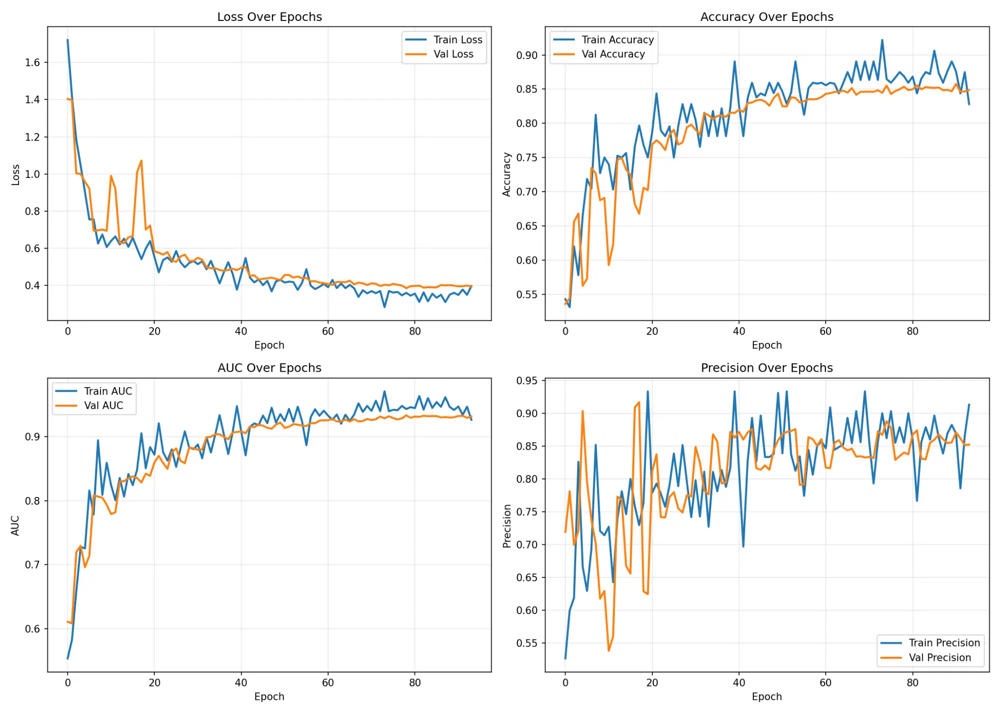
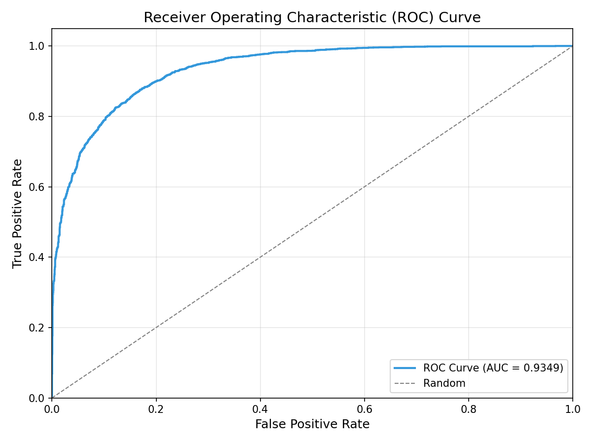
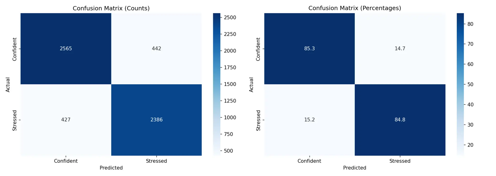

# Viva Defense: Real-Time Facial Expression Sensor

<p align="center">
  
</p>

This repository contains the code and resources for **Viva Defense**, a real-time facial expression sensor that detects whether a person appears **Confident** or **Stressed**. The project leverages a custom-trained Convolutional Neural Network (CNN) to classify facial expressions, providing a binary signal that can be used to create adaptive AI assistants or user-reactive software.

We've all been there, sitting in a Viva or Interview, trying to answer technical questions while keeping a straight face, even though we're panicking on the inside. 😅 I wanted to build an AI that doesn't just answer questions, but actually *reads the room*.

---

## 🎯 The Problem & My Solution

Standard emotion detection models often classify expressions into 7 or more categories (Anger, Fear, Sadness, etc.), which can be noisy and inaccurate for specific contexts like a high-pressure interview. My goal was to simplify this problem into a more relevant, binary classification.

**My Solution:**
I engineered a smarter dataset by mapping micro-expressions into two contextual buckets:
- ✅ **Confident:** Mapped from *Happy* + *Neutral* expressions.
- ⚠️ **Stressed:** Mapped from *Fear* + *Anger* + *Sadness* expressions.

By simplifying the problem domain, the model can focus on the most relevant cues, leading to significantly higher accuracy for this specific use case.

---

## ✨ Key Features

- **Real-Time Performance:** Optimized for low-latency inference using OpenCV and TensorFlow.
- **High Accuracy:** Achieves **93.49% AUC** on the test set by focusing on a binary classification task.
- **Smart Data Engineering:** Maps 7 standard emotions into two context-relevant classes (Confident vs. Stressed).
- **Advanced Model Architecture:** Uses a custom CNN with **Spatial Attention Modules** to intelligently focus on key facial regions like the eyes and mouth.
- **Comprehensive Training Notebook:** A full-featured Google Colab notebook is provided, covering everything from data loading to model evaluation and export.
- **Multiple Export Formats:** The trained model is available in Keras, TensorFlow SavedModel, and TFLite formats for flexible deployment.

---

## 🛠️ Tech Stack & Architecture

- **Frameworks & Libraries:** TensorFlow, Keras, Scikit-learn, OpenCV, Pandas, Seaborn
- **Model:** Custom CNN with Spatial Attention Modules, Batch Normalization, and Dropout for regularization.
- **Training Environment:** Google Colab with T4 GPU, utilizing Mixed-Precision Training for faster performance.
- **Deployment:** Real-time inference script using OpenCV for webcam capture and TensorFlow for prediction.

<p align="center">
  
</p>

---

## 📈 Model Performance

The model was trained for over 90 epochs and demonstrated excellent performance and generalization on the unseen test set.

| Metric | Test Set Score |
| :--- | :---: |
| **Accuracy** | 85.1% |
| **AUC Score** | 93.49% |
| **Precision (Stressed)** | 84% |
| **Recall (Stressed)** | 85% |

<p align="center">
  
  <br/>
  <em>ROC Curve showing an AUC of 0.9349, indicating strong classification performance.</em>
</p>

<p align="center">
  
  <br/>
  <em>The model correctly identifies Stressed individuals 84.8% of the time and Confident individuals 85.3% of the time.</em>
</p>

---

## 🚀 How to Use

1.  **Clone the Repository:**
    ```bash
    git clone https://github.com/musagithub1/Viva-Defense-Face-Sensor.git
    cd Viva-Defense-Face-Sensor
    ```

2.  **Train the Model (Optional):**
    - Upload the `DataSet.zip` file to your Google Drive.
    - Open the `Viva_Defense_Face_Sensor_Training.ipynb` notebook in Google Colab.
    - Update the `ZIP_FILE_PATH` variable to point to the location of your `DataSet.zip` file.
    - Run all cells to train the model from scratch. The trained models will be saved to your Google Drive.

3.  **Run the Real-Time Demo:**
    - Make sure you have Python, OpenCV, and TensorFlow installed.
    - Download the trained model file (`viva_defense_final.keras`) from the [releases](https://github.com/musagithub1/Viva-Defense-Face-Sensor/releases) page.
    - Run the demo script:
    ```bash
    python webcam_demo.py
    ```

---

## 📝 Dataset

The dataset used in this project is derived from the **FER2013** (Facial Expression Recognition 2013) dataset, originally published on Kaggle.

> **Original Source:** [FER2013 on Kaggle](https://www.kaggle.com/datasets/msambare/fer2013)

The original dataset contains 35,887 grayscale images (48x48 pixels) categorized into 7 emotion classes. For this project, I re-engineered the dataset by mapping these emotions into two binary classes:

| Original Emotion | Mapped Class |
| :--- | :--- |
| Happy, Neutral | **Confident** |
| Fear, Anger, Sadness | **Stressed** |
| Surprise, Disgust | *Excluded* |

This mapping resulted in a final dataset of **29,262 images** optimized for the interview/viva context.

---

## 📊 Dataset Analysis Summary

> **[View the Full Dataset Analysis Report](./analysis/Dataset_Analysis_Report.md)**

A comprehensive analysis of the dataset was conducted to inform the model development process. Here are the key takeaways:

- **Mouth Region is the Primary Differentiator:** The most significant and statistically robust differences between "Confident" and "Stressed" faces are found in the lower third of the face. An open mouth is a strong indicator of the "Stressed" class.
- **Dataset is Well-Suited for Deep Learning:** The dataset is large (29,262 images), well-balanced, and preprocessed (48x48 grayscale), making it an excellent starting point for training a CNN.
- **Intensity Differences are Significant:** "Stressed" faces are generally brighter, suggesting that even simple models based on intensity histograms could achieve some level of accuracy.

This analysis confirmed that a CNN architecture with a spatial attention mechanism, designed to focus on the mouth region, would be the most effective approach.

---

## 🙏 Acknowledgements

- I'd also like to sincerely thank **Dr. Mumtaz Zahoor** (AI subject teacher) and **Ayesha Khalid** for their guidance and support throughout this project.
- Special thanks to my colleagues **Abdul Haseeb** and **M saad Arshad** for their help, discussions, and encouragement during development.

---

## 🔗 Connect with Me

Let's connect! Feel free to reach out for collaborations or just a chat about AI and computer vision.

[](https://www.linkedin.com/in/mussakhan-ai/)
