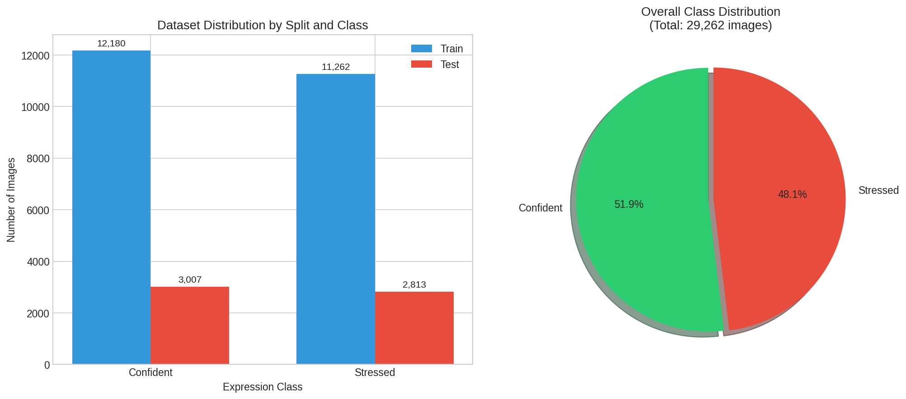
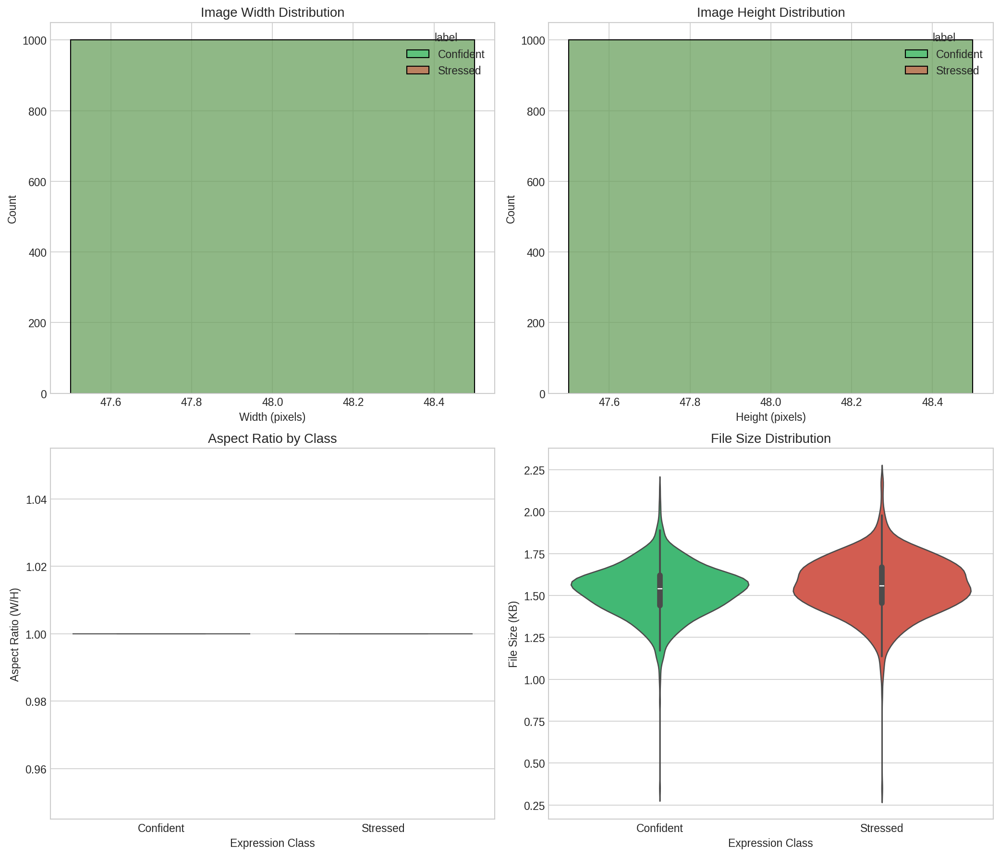
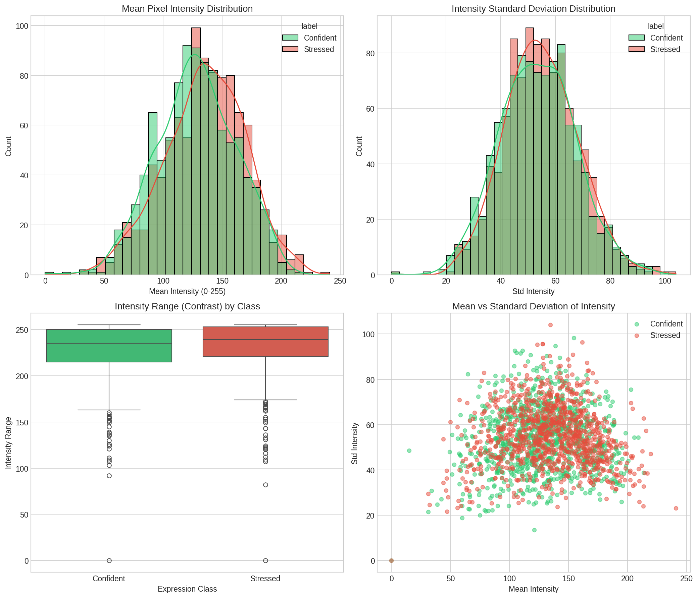
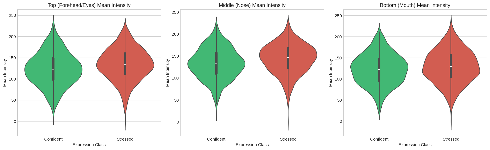
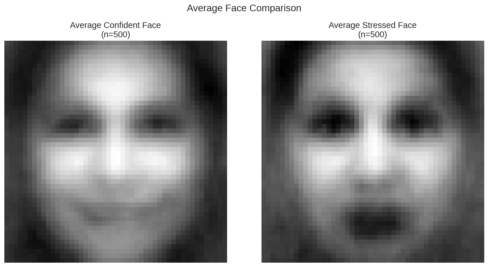
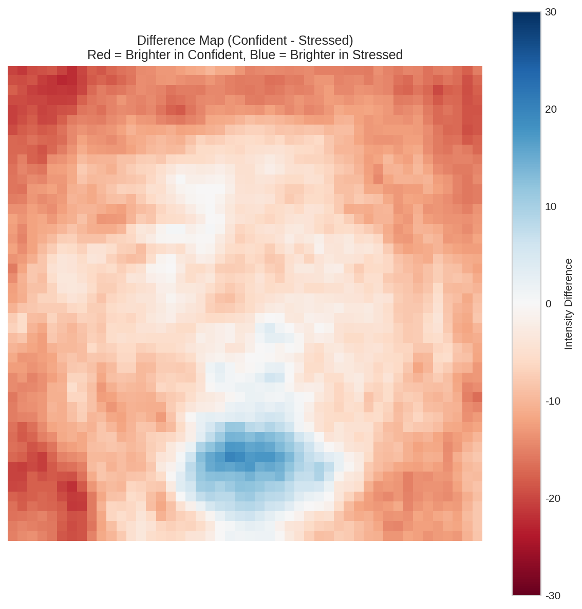

# Facial Expression Dataset Analysis: Confident vs. Stressed

**Date:** December 28, 2025
**Author:** Mussa Khan

## 1. Introduction

This report presents a comprehensive analysis of the facial expression dataset derived from the [FER2013 (Facial Expression Recognition 2013)](https://www.kaggle.com/datasets/msambare/fer2013) dataset on Kaggle. The original dataset has been re-engineered to map 7 emotion classes into two binary categories: "Confident" and "Stressed". The primary objective of this analysis is to extract actionable insights and provide data-driven recommendations for the development of a sensor-based software that reacts to facial expressions. We have examined the dataset's structure, image properties, and statistical features to identify key discriminators between the two emotional states.

## 2. Dataset Overview

The dataset is well-structured, divided into training and testing sets, and contains a large number of images, making it suitable for training deep learning models. In total, the dataset comprises **29,262 images**.

- **Training Set:** 23,442 images (80.1% of total)
- **Testing Set:** 5,820 images (19.9% of total)

The class distribution is nearly balanced, which is ideal as it minimizes the risk of model bias towards one class. The "Confident" class slightly outnumbers the "Stressed" class, with an imbalance ratio of approximately 1.08:1.

| Split | Class     | Image Count | Percentage of Split |
| :---- | :-------- | :---------- | :------------------ |
| Train | Confident | 12,180      | 52.0%               |
| Train | Stressed  | 11,262      | 48.0%               |
| Test  | Confident | 3,007       | 51.7%               |
| Test  | Stressed  | 2,813       | 48.3%               |

*Figure 1: The bar chart shows the number of images per class for both training and testing splits. The pie chart illustrates the overall class balance across the entire dataset.*

## 3. Image Properties

A consistent and uniform dataset is crucial for building robust machine learning models. Our analysis of the image properties reveals a high degree of standardization across the dataset.

- **Dimensions:** All images in the dataset have a uniform size of **48x48 pixels**. This consistency eliminates the need for resizing during preprocessing, which simplifies the model training pipeline and reduces computational overhead.
- **Color Mode:** All images are in **grayscale** (Mode 'L'). This is advantageous as it reduces the input data's dimensionality (from three channels in RGB to one) without significant loss of facial expression information.
- **File Size:** The file sizes are small and consistent, with a mean of approximately **1.54 KB**. This is expected given the small image dimensions and grayscale format.

*Figure 2: The histograms for image width and height confirm the uniform 48x48 dimension. The violin plots show a similar file size distribution for both classes.*

## 4. Visual and Statistical Analysis

To uncover the distinguishing features between "Confident" and "Stressed" expressions, we performed a deeper statistical and visual analysis. This involved examining pixel intensity distributions, analyzing specific facial regions, and creating composite images to highlight average differences.

### 4.1. Intensity Analysis

Pixel intensity provides valuable clues about facial muscle contractions, which are central to expressions. Our analysis shows statistically significant differences in intensity between the two classes.

- **Mean Intensity:** "Stressed" faces, on average, have a slightly higher mean pixel intensity (135.15) compared to "Confident" faces (128.03). This suggests that stressed expressions might involve more muscle activation that leads to brighter areas on the face, such as widened eyes or an open mouth.
- **Intensity Standard Deviation:** The standard deviation of intensity, which reflects the contrast within the image, is also slightly higher for "Stressed" faces. This could indicate more pronounced shadows and highlights due to muscle tension.

*Figure 3: These plots show the distribution of mean intensity and standard deviation. The distributions for "Confident" and "Stressed" classes show considerable overlap, but with discernible differences in their central tendencies.*

### 4.2. Regional Facial Analysis

By dividing the face into three horizontal regions (top, middle, and bottom), we can pinpoint which facial areas are most indicative of stress or confidence.

- **Top Region (Forehead/Eyes):** The mean intensity in the top region is significantly higher for "Stressed" faces. This aligns with common expressions of stress, such as raised eyebrows or widened eyes.
- **Middle Region (Nose):** Similar to the top region, the middle part of the face is brighter in "Stressed" images.
- **Bottom Region (Mouth):** The most pronounced difference is in the mouth region. The average "Stressed" face shows a significantly brighter mouth area, which is clearly visible in the average face visualizations and is likely due to an open mouth in expressions of shock, fear, or distress. The standard deviation of intensity is also significantly higher in the bottom region for stressed faces, indicating more complex textures and shapes (e.g., teeth, tongue).

*Figure 4: The violin plots compare the mean intensity across three facial regions. The bottom (mouth) region shows a particularly strong separation between the two classes.*

### 4.3. Average Face Comparison

To visualize the archetypal "Confident" and "Stressed" faces, we computed an average face for each class by averaging 500 sample images. The results are striking.

- The **Average Confident Face** appears to have a neutral to slightly smiling expression, with relaxed features.
- The **Average Stressed Face** clearly shows an open mouth and potentially widened eyes, characteristic of surprise or distress.

*Figure 5: The average faces provide a clear visual summary of the typical features for each expression class.*

The **Difference Map** further highlights the key areas of divergence. The blue region in the map indicates areas that are brighter in "Stressed" faces, which corresponds directly to the mouth and chin area. The reddish areas show where "Confident" faces are brighter, primarily around the cheeks and nose bridge.

*Figure 6: The difference map (Confident - Stressed) visually confirms that the most significant difference between the two expressions is in the mouth region.*

### 4.4. Statistical Significance

To validate our observations, we conducted t-tests to determine if the differences in various features were statistically significant. The results confirm that several features, particularly those related to the lower half of the face, are strong differentiators.

| Feature             | Confident Mean | Stressed Mean | P-value  | Significance | Cohen's d | Interpretation                                  |
| :------------------ | :------------- | :------------ | :------- | :----------- | :-------- | :---------------------------------------------- |
| **bottom_mean**     | 122.35         | 129.55        | 0.0009   | ***          | -0.192    | Mouth region is significantly brighter in Stressed. |
| **middle_mean**     | 133.03         | 143.96        | < 0.0001 | ***          | -0.322    | Nose region is significantly brighter in Stressed.  |
| **top_mean**        | 123.65         | 134.50        | < 0.0001 | ***          | -0.285    | Forehead/eyes region is brighter in Stressed.   |
| **bottom_std**      | 50.62          | 52.74         | 0.0141   | *            | -0.142    | Mouth region has higher contrast in Stressed.   |
| edge_density        | 120.70         | 120.87        | 0.7491   | ns           | -0.018    | No significant difference in edge density.      |

*Table 2: Results of statistical significance tests. Features with p-values < 0.05 are considered significant discriminators. (*** p < 0.001, * p < 0.05, ns = not significant)*

## 5. Key Findings and Recommendations

Based on our comprehensive analysis, we have identified several key findings that can directly inform the development of your face-reactive sensor software.

### 5.1. Key Findings

1.  **Mouth Region is the Primary Differentiator:** The most significant and statistically robust differences between "Confident" and "Stressed" faces are found in the lower third of the face. An open mouth is a strong indicator of the "Stressed" class.

2.  **Dataset is Well-Suited for Deep Learning:** The dataset is large, well-balanced, and preprocessed (cropped and resized 48x48 grayscale images). This makes it an excellent starting point for training a convolutional neural network (CNN) with minimal preprocessing.

3.  **Intensity Differences are Significant:** While subtle, there are statistically significant differences in pixel intensity across all facial regions, with "Stressed" faces generally being brighter. This suggests that even simple models based on intensity histograms could achieve some level of accuracy.

### 5.2. Recommendations for Sensor Development

1.  **Focus on the Mouth Region:** Your model's architecture should be designed to give significant weight to features from the lower part of the face. Techniques like attention mechanisms could be employed to guide the model to focus on this region.

2.  **Utilize a Convolutional Neural Network (CNN):** Given the nature of the data, a CNN is the most appropriate model architecture. A relatively simple CNN architecture should be sufficient to achieve high accuracy on this dataset. Transfer learning with models pre-trained on larger face datasets (like VGG-Face) could also be a powerful approach.

3.  **Preprocessing Pipeline:** Although the images are already preprocessed, we recommend the following steps before feeding them into a model:
    *   **Normalization:** Scale pixel values from the [0, 255] range to [0, 1] or [-1, 1] to stabilize training.
    *   **Data Augmentation:** To improve model generalization and mitigate the slight class imbalance, apply data augmentation techniques such as random rotations, horizontal flips, and slight brightness adjustments.

4.  **Real-Time Performance:** The small 48x48 image size means that a well-designed model can perform inference very quickly, making it suitable for real-time applications as intended for your sensor.

## 6. Conclusion

This dataset provides a strong foundation for building a reliable facial expression recognition system to differentiate between "Confident" and "Stressed" states. The analysis has revealed that the mouth region is the most critical facial feature for this specific classification task. By leveraging a convolutional neural network that pays special attention to this area, you can develop a highly accurate and responsive sensor.

We are confident that these insights will accelerate your development process and help you create a robust and effective face-reactive software.

---
